<picture>
  <source media="(prefers-color-scheme: dark)" srcset="assets/hero-dark.svg">
  
</picture>

**André Wiesehoff**, Laravel-Entwickler aus Ahaus, Nordrhein-Westfalen, Deutschland. Ich baue Web-Anwendungen mit **Laravel**, **Livewire** und **KI**.

<samp>PHP · Laravel · Livewire · Alpine.js · Tailwind · MariaDB · Redis</samp>

[awiesehoff.de](https://awiesehoff.de) · [LinkedIn](https://www.linkedin.com/in/awiesehoff) · [it@awiesehoff.de](mailto:it@awiesehoff.de)
